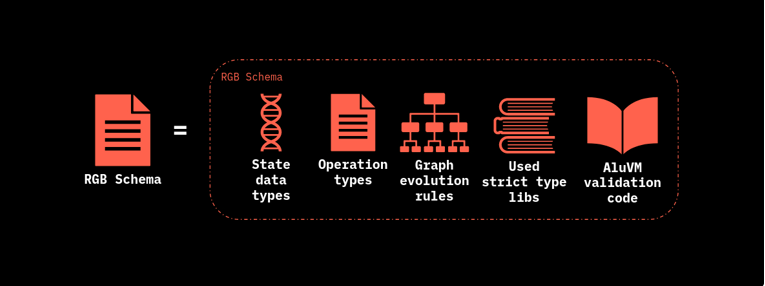
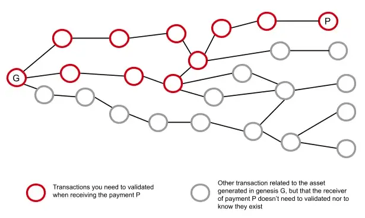
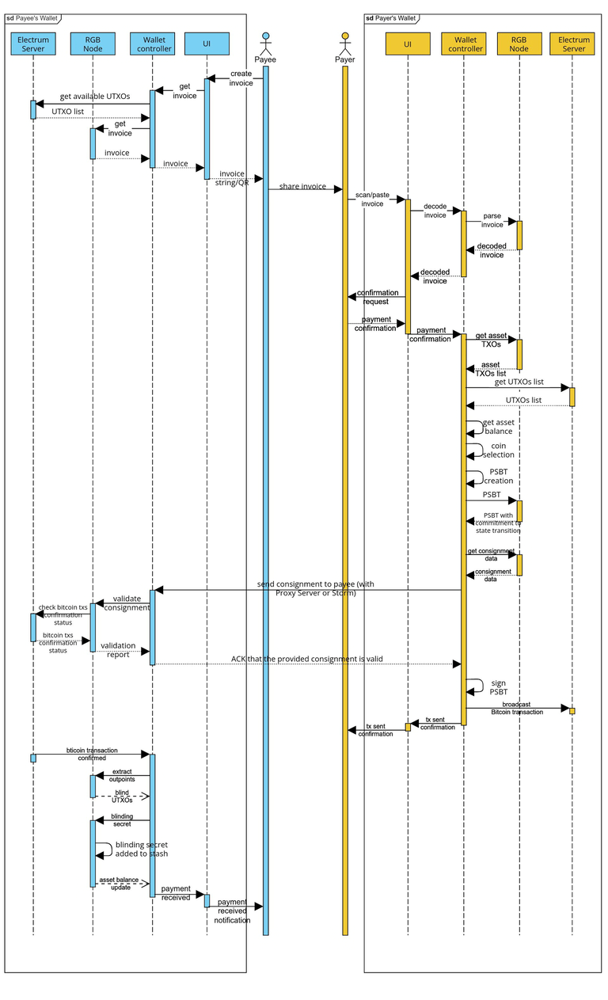

# RGB和Ordinals/Omni的区别

## Ordinals

https://www.chaincatcher.com/article/2092605

Ordinal（序数）于2023年1月份提出，是为比特币最小单位聪satoshis（sats）编号的系统。

1BTC=1亿sats，原本每单位聪之间都是相同的，即小明持有的1 BTC与小兰持有的1 BTC是相同的。

通过Ordinals可按照一定顺序排列这些sats，并给它们分配一个特定的序数，即Ordinals协议给每个聪sats都分配了唯一的编号。这样就赋予了每个聪的独特性，这个编号标识符将支持用户跟踪区块链上的每个sats。当用户在这个聪sats上附加上特定的信息，比如图片，文字，代码等，就可让每个聪变得独一无二，这也就是所谓的比特币NFT。附加的信息被称为“铭文inscriptions”，在聪sats上附加信息的过程被称为“铭刻inscribe”，即把“铭文”铭刻在聪上。

用户@domodata认为Ordinals协议不仅仅可用来发行NFT，还可以用来发行同质化代币。当附加的信息（铭文）按照一个统一的协议标准（JSON数据格式）来附加，就可变成同质化代币BRC20。简单来说，BRC20可理解为是一种变异的Ordinals NFT，NFT上铭文刻录的是图片，BRC20上标识的铭文都是统一的JSON格式的文本数据（Text）。在BRC20种，铭文亦当作BRC20代币的记账账本，可用来追踪每一次代币的转移。


源协议网站，目前网站比最开始就3个简单的页面完善了许多。

https://docs.ordinals.com/

**ordi字符串**

```
{
  "p": "brc-20",
  "op": "deploy",
  "tick": "ordi",
  "max": 21000000,
  "lim": 1000
}
```

https://mempool.space/tx/b61b0172d95e266c18aea0c624db987e971a5d6d4ebc2aaed85da4642d635735
部署 ordi的tx。

```
OP_PUSHBYTES_32 9e2849b90a2353691fccedd467215c88eec89a5d0dcf468e6cf37abed344d746
OP_CHECKSIG                  #验证签名
OP_0
OP_IF
OP_PUSHBYTES_3 6f7264 # 原文为十六进制的 解码后为 ord
OP_PUSHBYTES_1 01
OP_PUSHBYTES_24 746578742f706c61696e3b636861727365743d7574662d38 #text/plain;charset=utf-8
OP_0
OP_PUSHDATA1 7b200a20202270223a20226272632d3230222c0a2020226f70223a20226465706c6f79222c0a2020227469636b223a20226f726469222c0a2020226d6178223a20223231303030303030222c0a2020226c696d223a202231303030220a7d #这个解码后就是上面的内容。
OP_ENDIF
```


## **Onmi**

Omni协议通过将自定义数据嵌入到比特币交易中来实现功能。这些交易包括特定的元数据，用于解释代币转移、资产发行或其他操作。Omni网络的节点解析这些嵌入在比特币交易中的数据，执行相应的协议逻辑。这

https://mempool.space/tx/046ecb298907bb2441959f6021f395dd754adcb74367d95fb517caea2862013d
最近的一个usdt转账内容。

观察其第二个output的opreturn的内容

```
OP_RETURN
OP_PUSHBYTES_20 6f6d6e69000000000000001f0000000001c9c380
```

**协议标识**：`omni` (6f6d6e69)

**功能ID**：`00000000`，表示这是一个"简单发送"（Simple Send）操作。

**资产ID**：`0000001f`，表示USDT代币（资产ID 31）。

**发送数量**：`0000000001c9c380`，表示 **0.3 USDT**。


## RGB

RGB 是一种在比特币上发行资产的协议，也可以被视为一种链外智能合约系统。与比特币本身不同，RGB 并不依赖于比特币的全节点共识来验证所有交易状态，而是通过客户端验证的方式，用户自己验证每一步的状态转换。这使得 RGB 的验证成本更低、更高效，同时保护了用户隐私。

RGB 的核心设计基于比特币的 UTXO 模型，每个资产状态都附着在某个 UTXO 上，所有权状态变更时需要消耗该 UTXO。通过使用哈希值嵌入比特币交易，RGB 将状态变化的复杂性转移到链外，极大减少了区块链上的数据存储需求。这种设计使 RGB 既具有良好的扩展性，又能保持经济性和隐私性。

RGB 还通过创新的 "一次性密封" 模型，确保每个状态只能被一次性消耗，进一步增强了安全性和灵活性。

https://www.btcstudy.org/2023/09/12/the-potential-of-RGB-protocol/

### vs Onmi 

RGB的opreturn commitment(op return承诺)是一个hash。是没办法反向解码成信息。用户可以通过btc上的hash来验证RGB链下的内容是不是我这个链下的信息。反过来不行。

Onmi仅仅是一个明文的内容。

对于用户来说只能信任indexer。因为需要从token部署以来所有的信息才能验证这个tx是不是没有被双花。

### vs Ordi

RGB绑定的是单个交易内的一个输出。他不会像Ordi一样伴随sats的一生。

对于RGB来说，他只关心output的状态。对于单笔tx内来说，如果是一个opreturn的话看output1这个utxo如果是taproot的话就看这个output本身。

这个utxo存在不存在？是不是被花费了？所蕴含的信息对不对？仅此而已。因为工作量不是很大所以客户端完全可以验证这些内容。因为每个RGBtx都会包含自从创世以来所有btc上面的txid。用户就可以单独请求这些tx信息。然后验证。

而ordi同样需要自己运行全节点来验证这个信息是不是对的。有没有被双花？


# 如何理解RGB VM和scripting？ 

## BTC脚本

以一种常见的交易类型“Pay-to-PubKey-Hash (P2PKH)”为例：

**锁定脚本**：

```
OP_DUP OP_HASH160 <公钥哈希> OP_EQUALVERIFY OP_CHECKSIG
```

**解锁脚本**：

```
<签名> <公钥>
```

执行流程

1.首先，将解锁脚本中的 `<签名>` 和 `<公钥>` 压入栈。

|     btc栈     |                        剩余脚本                         |
| :-----------: | :-----------------------------------------------------: |
| <签名> <公钥> | OP_DUP OP_HASH160 <公钥哈希> OP_EQUALVERIFY OP_CHECKSIG |

2.执行 `OP_DUP`，复制栈顶的 `<公钥>`。

|        btc栈        |                     剩余脚本                     |
| :-----------------: | :----------------------------------------------: |
| <签名> <公钥><公钥> | OP_HASH160 <公钥哈希> OP_EQUALVERIFY OP_CHECKSIG |

3.执行 `OP_HASH160`，对复制的 `<公钥>` 进行哈希处理，得到一个公钥哈希，并将其压入栈。

|         BTC 栈          |               剩余脚本                |
| :---------------------: | :-----------------------------------: |
| <签名><公钥> <公钥哈希> | <公钥哈希> OP_EQUALVERIFY OP_CHECKSIG |

4.将脚本中的 `<公钥哈希>` 压入栈。

|              BTC 栈               |          剩余脚本          |
| :-------------------------------: | :------------------------: |
| <签名><公钥> <公钥哈希><公钥哈希> | OP_EQUALVERIFY OP_CHECKSIG |

5.执行 `OP_EQUALVERIFY`，比较栈顶的两个值（计算出的公钥哈希和提供的公钥哈希），如果相等则继续，否则脚本失败。

|    BTC 栈    |  剩余脚本   |
| :----------: | :---------: |
| <签名><公钥> | OP_CHECKSIG |

执行 `OP_CHECKSIG`，用提供的 `<签名>` 和 `<公钥>` 验证签名的有效性。

| BTC 栈 | 剩余脚本 |
| :----: | :------: |
|  True  |   (空)   |

如果整个脚本执行完成后，栈顶的元素为 `true`，则交易验证通过。

## RGB

RGBVM实际上是一个叫做[AluVM](https://www.aluvm.org/)的东西。

AluVM是算法逻辑单元虚拟机的缩写，它是一种基于寄存器的虚拟机，用于智能合约验证和分布式计算，可用于但不限于 RGB 合约验证。

“ AluVM is simply math and few bound-width bytestring manipulations and that's it. ”（AluVM 仅仅是一些简单的数学运算和有固定宽度的字节串操作）但是因为是链下，计算资源对比链上高很多。所以基本来说是**图灵完备**的。

简单来说对比来说可以把btc的opcode比作AluVM指令集。btc的栈比作AluVM的寄存器。 

但是因为opcode的指令集是非图灵完备的加上btc上面有限的空间。所以btc的脚本扩展性是明显受限的。而AluVM是部分复制的**无限状态机**（PRISM）。


# 如何理解RGB合约schema

虽然RGBVM不受限但是RGB的“合约”编写实际上是受限的。因为在’合约代码“和VM中间还有个东西叫做Schema。

https://www.rgbfaq.com/glossary/schema-and-scripts/schema 官方解释的什么schema

RGB Schema 通过编码定义了 Genesis（创世）的必要模板，并嵌入了所有可用合约操作的规则，代表了其业务逻辑，允许相关状态进行更新。

RGB Schema 类似于面向对象编程（OOP）语言中的类。在使用这个类之前需要提供数据new一个类出来。因此，这样的结构用于定义 RGB 合约和资产的各种标准，例如：同质化资产、收藏品、数字身份等。

**schema在语境中可以理解成蓝图。简单理解就是定义以后这个合约是什么运行和验证的。“合约代码”实际上是往蓝图上面添加具体信息然后他会生成对应的zk电路，验证代码和能被AluVM执行的代码。**


在 RGB 上发行资产的发行者使用 Schema（并向公众提供），以在 Genesis 中定义编码的发行属性。这样，合约就可以被 RGB 钱包支持并完全运行。因此，当用户接收到有关 RGB 上某一资产的信息（数据和合约）时，他们必须根据该资产发行者分发的 Schema 进行验证。

事实上，Schema 验证是用户在以任何方式与合约交互之前需要进行的第一步操作（例如，执行所需的合约操作）。

从功能角度来看，Schema 构建解决了以下问题：

- 拥有的状态和分配类型是什么？

- 存在什么类型的权态（Valences）？

- 合约具有什么全局状态？

- Genesis 的结构是怎样的？

- 可能的状态转换和状态扩展是什么？

- 合约操作可以包含什么元数据？

- 状态数据在状态转换中如何允许发生变化？

- 什么样的交易顺序是合法的？


<p align="center">
  
</p>


**从技术角度来看，RGB Schema 是一个功能性的声明性文档，需要编译才能在 RGB 应用程序和钱包中有效使用。**

schema还允许**对合约进行编程更新，而无需**修改基础设施软件，以便钱包和浏览器可以接受修改后的资产类型，而无需对各自的代码进行任何更改。

即使 Schema 的这种架构选择看起来与基于区块链的合约（例如以太坊上实现的合约）非常不同。在后者系统中，合约本身是作为可执行代码提供的，该代码实现了更改和执行状态的规则，并最终直接存储到区块链中。相比之下，在 RGB 中，合约完全以声明式的方式进行编码。

在客户端验证阶段执行的每个合约操作中，合约 Schema 始终被引用和检查。特别是在编译之后，Schema 可以提供执行由 Genesis 操作表示的合约发行所需的所有数据结构。

如前所述，Schema 清楚地区分了合约开发者和发行者，发行者可能对编码和编程一无所知。这种方法广泛使用合约模板，可以立即供发行者使用，从而避免了实施阶段常见的编程错误。

用户验证合约信息也是通过zk和Aluvm两块来验证的。

每一个schema都需要对应的一套zk电路模板。因为schema为 RGB 的客户端部分嵌入**状态验证脚本**和相关函数。脚本通过 AluVM 引擎执行，该引擎代表了业务逻辑执行和验证的最基本部分。

[ zk入门资料整理](https://learnblockchain.cn/article/8337)


**Q:**Does RGB have a built-in ZKVM that supports RISC? My current understanding is that RGB uses aluvm for execution and then adds an extra layer to constrain the execution results, rather than implementing a constraint for each RISC instruction. I am not sure if my understanding is correct.（RGB 是否内置了支持 RISC 的 ZKVM？我目前的理解是，RGB 使用 aluvm 执行，然后添加额外的一层来约束执行结果，而不是为每条 RISC 指令实施约束。我不确定我的理解是否正确。）

**A:**
RGB does not support RISC since in client-side validation there is no such concept as random access memory and RISC architecture is overly-complex for what we need. AluVM is simply math and few bound-width bytestring manipulations and that's it. 

On the other hand AluVM and validation logic can be made in zk-SNARK circuit with zk-LLVM - the direction we will be working on this and next year

AluVM is written in rust. You compile it via LLVM intermediate representation - and convert that into zk circuit using zk-LLVM. That's in brief. 

What is harder is to compress the historical proofs for single-use seals - that would require either zkSync integration - or use of new layer 1 like Prometheus. 

Well, the motivation is ultra-simple: reduce the size of the consignment and make them non-growing

（RGB 不支持 RISC，因为在客户端验证中不存在随机存取内存的概念，而且 RISC 架构对于我们的需求来说过于复杂。AluVM 仅仅是一些简单的数学运算和有固定宽度的字节串操作，仅此而已。另一方面，AluVM 和验证逻辑可以通过 zk-LLVM 在 zk-SNARK 电路中实现，这也是我们今年和明年的工作方向。
AluVM 是用 Rust 编写的。你可以通过 LLVM 中间表示（IR）编译它，然后使用 zk-LLVM 将其转换为 zk 电路。简单来说就是这样。更难的部分是如何压缩一次性密封的历史证明 —— 这需要集成 zkSync 或使用新的第 1 层协议（如 Prometheus）。
我们的动机非常简单：缩小 Consignment 的规模，使其不再增长。）


<p align="center">
  
</p>

**LLVM**（Low-Level Virtual Machine） 是一个编译器框架，可以用于生成、优化和编译中间代码（intermediate code）到机器代码。它最早是作为一个虚拟机项目开始的，但发展成了一个强大且灵活的编译器基础架构，现在被广泛应用于多种编程语言。

**zk-LLVM** 是一个基于 LLVM 的扩展工具，它将 LLVM 的编译功能与零知识证明（ZKP）集成在一起，目的是生成用于零知识证明的电路。通过 zk-LLVM，开发者可以用高级语言（如 Rust 或 C++）编写程序，然后将其编译成适用于零知识证明的 zk 电路。

**Consignment**

在受[客户端验证](https://docs.rgb.info/annexes/glossary#client-side-validation)约束的各方之间传输的数据。在 RGB 中，有 2 种类型的托运：

- Contract Consignment：由合约发行者提供，包括有关合约设置的信息，例如 [Schema](https://docs.rgb.info/annexes/glossary#schema)、[Genesis](https://docs.rgb.info/annexes/glossary#genesis)、[Interface](https://docs.rgb.info/annexes/glossary#interface) 和 [Interface Implementation](https://docs.rgb.info/annexes/glossary#interface-implementation)。

- Transfer Consignment：由付款人用户方提供，包含截至[当前路线最后一个tx](https://docs.rgb.info/annexes/glossary#terminal-consignment-consignment-endpoint)（原文是 terminal consignment）的所有状态转换历史记录。（终端的意思是DAG中叶子节点）

  

**所以总的来说RGBVM对于BTC脚本不单单是运行，还包括验证。**


# 如何理解RGB 转账 

在这样一个最基本的场景。Alice给Bob发送 RGBT这个token。这个token是合约叫做C。

#### 1.初始状态

​	最开始Alice是拥有合约信息和密封当前状态的UTXO。Bob没有合约信息。

#### 2.导入合约

​	BoB需要首先导入共识内容，也就是合约C（Contract Consignment）。因为他需要知道合约C是怎么运作的，并且要确认是不是他想要的那个合约。（核对合约id）

#### 3.创建invoice

​	因为链上存储的都是TX执行完毕后的结果。而且Bob没办法操控Alice的所拥有的状态并且Alice也不懂Bob用于密封新状态的UTXO是什么。所以需要告诉A把怎样的一个结果发到链上。这个就是Invoice了。这个invoice里面包含 指示 Bob创建一个遵循合约规则的新**状态**，并以隐藏的形式嵌入**一个新的 密封 定义**，指向他的一个 UTXO。通过这种方式，Alice 为 Bob 分配**了新状态的一些所有权**：例如，一定数量的代币的所有权。

#### 4.支付invoice

​	之后，Alice 使用一些 [PSBT](https://docs.rgb.info/annexes/glossary#partially-signed-bitcoin-transaction-psbt) 钱包工具准备了一笔交易，该交易花费了由先前的 密封之前状态的UTXO 。在这个btc tx中，Alice 在一个输出中嵌入了对新状态数据的承诺，该数据使用 [Opret](https://docs.rgb.info/commitment-layer/deterministic-bitcoin-commitments-dbc/opret) 或 [Tapret](https://docs.rgb.info/commitment-layer/deterministic-bitcoin-commitments-dbc/tapret) 规则，具体取决于所选的方法。简而言之A接受到这个Invoice然后执行。

#### 5.确认交易完成

​	A执行完将结果（Transfer Consignment）发送给B让他确认下对不对B确认之后A就可以把执行结果发送到链上了（实际上A可以不管不顾直接把执行结果发送到链上）。等待链上确认完毕RGB的tx也就完毕了。

这个Transfer Consignment包含除了新状态之外，它还包含 Alice 已经拥有的客户端数据的有组织stash。

Bob在accept的时候是做了下面内容：

- 验证 Consignment中包含的每个 RGB 状态数据，包括最后一个将所有权分配给 Bob 对合约的 New State。
- 通过Consignment中包含的Anchor（锚点），他验证了从创世到最后状态发生的见证交易顺序的时间顺序，以及指向此处包含的 RGB 数据的相关承诺。


<p align="center">
  
</p>

## 更加细节部分

### Assignments

在RGB合约内部还有一个类似UTXO的结构  **Assignments** 来记录RGB合约的交易信息。

Assignments 是负责 [Seal Definition](https://docs.rgb.info/annexes/glossary#seal-definition) 操作和该 Seal Definition 绑定到的相关 [Owned State](https://docs.rgb.info/annexes/glossary#owned-state) 的核心结构。它们是将数字资产（在拥有状态中描述的**）合法转让**给由拥有特定比特币 [UTXO](https://docs.rgb.info/annexes/glossary#utxo) 确定的新所有者的核心部分。Assignment 可以比作 Bitcoin Transaction Output，但可能嵌入更多的表现力和潜力。

每个 Assignment 都由以下组件组成：

- `AssignmentType`，它是存储在 Assignment 中的数字资产的标识符（例如，用于在令牌传输中声明传输函数的 `assetOwner` 声明）。

- `Seal 定义`，它是包含对 UTXO 的引用的子结构。

- `Owned State`，指定如何修改与 `AssignmentType` 关联的属性。

  

RGB 的独特特性在于，Seal Definition 和 Owned State 都可以以显示（Revealed）或隐藏（Concealed）形式呈现。这对于在状态转换的构建以及后续由合约涉及的各方进行验证时，选择性地保持高隐私性和可扩展性特别有用。显示形式的结构可用于验证在先前状态转换中输入的相同数据，这些数据的哈希摘要表示该结构的隐藏形式。

Seal Definition 和 Owned State 的所有四种显示/隐藏形式组合如下图所示：


<p align="center">
  
</p>

### Seal Definition

Assignment 结构的第一个主要组件是 Seal Definition，其显示形式本身是由四个字段组成的结构：

- **txptr**：比简单的比特币交易哈希更复杂的对象，可以有两种不同的类型：
  - **Genesis Seal**：为 Genesis seal definition 创建的 Seal。它始终包含一个指向现有 UTXO 的 txid 字段。
  - **Graph Sea**l：本身可以有两种形式：
    - 简单情况下，txid 指向被选为 Seal 的 UTXO。
    - **WitnessTx** 形式，解释为“自引用”定义。此构造的使用意味着 Seal Definition 所使用的交易与包含当前 Assignment 的见证交易相同。由于交易的最终 txid 取决于所有状态转换数据（包括 txptr），所以无法计算它，因为存在隐含的循环引用。实际上，WitnessTx 是一个空字段，用于处理多种情况下没有外部 UTXO 的情形，例如 Lightning Network 的承诺交易的生成和更新，或者接收者没有可用的 UTXO。
- **vout**：是输入到 txptr 中的 tx id 的交易输出编号，仅当 txptr 是 Graph Seal 时存在。txptr 字段和 vout 字段一起构成比特币交易的标准 outpoint 表示。
- **blinding**：8 字节的随机数，一旦 Seal 数据被哈希，可以有效隐藏这些数据，提高对暴力破解攻击的抵抗力。
- **method**：一个 1 字节字段，指示 Seal 关闭方法，将在相关见证交易中使用。可能值为 Tapret 或 Opret。


### Owned States

Assignment 的第二个组件是 Owned State，负责定义和存储由 Seal Definition 分配的数据。在介绍 Owned States 的特性之前，有必要简单讨论一下该结构的 Conceal/Reveal 特性。与 Global State 不同，Owned States 有两种形式：

- **Public Owned States**：相关数据必须始终由其所有者递归地以显示形式保留和转移。例如，它们可以应用于某些必须绑定到所有权但始终公开显示的图像文件。可描述为：“有人拥有，大家都知道”。
- **Private Owned States**：相关数据保持隐藏，仅在作为验证历史的一部分时才被揭示。例如，代币合约中转移的代币数量通常保持私有。这种形式可以总结为：“有人拥有，没人知道”。

在 RGB 中，Owned State 只能定义为以下四种 StateTypes 中的一种：Declarative、Fungible、Structured、Attachments，它们都有各自的显示和隐藏形式：

- **Declarative**：一种没有数据的 StateType，代表合约方可以执行的某种治理权利。例如，它可用于投票权。它的隐藏和显示形式是相同的。
- **Fungible**：允许在代币合约中转移同质化单位的 StateType。显示形式包含两个字段：amount 和 blinding factor；隐藏形式转换为一个包含 Pedersen 承诺的单字段结构，该结构承诺显示形式中的 amount 和 blinding factor。在未来的更新中，可以实现零知识密码证明（例如 Bulletproof），以证明在相同的 State Transition 中引用同质状态的输入总和等于同质 Owned States 的总和，而不透露实际数量。
- **Structured**：一种可以容纳有序且受限的数据集合的 State Type，可用于复杂合约验证方案的输入。最大存储大小限制为 64 KiB。显示形式为序列化为字节的 blob 数据，隐藏形式是该数据 blob 的 SHA-256 标记哈希：`SHA-256(SHA-256(tag_data) || SHA-256(tag_data) || blob)`，其中 `tag_data = urn:lnp-bp:rgb:state-data#2024-02-12`。
- **Attachments**：用于附加具有定义用途的任意文件，例如媒体文件、音频文件、文本、二进制等。实际文件与 Owned State 结构本身分开存放，显示形式的 Attachment 结构包含三个字段：`SHA-256 file_hash`、`MIME media type` 和提供附加隐私的 `salt factor`。隐藏形式是这三个字段的 SHA-256 标记哈希：`SHA-256(SHA-256(tag_attachment) || SHA-256(tag_attachment) || file_hash || media_type || salt)`，其中 `tag_attachment = urn:rgb:state-attach#2024-02-12`。此外，下表还总结了每种 **StateType** 的技术特性：

| 项目     | Declarative 声明 | Fungible 可替代        | Structured 结构      | Attachments 附件 |
| -------- | ---------------- | ---------------------- | -------------------- | ---------------- |
| 数据     | 没有             | 64 位有符号/无符号整数 | 任何 strict 数据类型 | 任何文件         |
| 类型信息 | 没有             | 已签名/未签名          | 严格类型             | MIME 类型        |
| 保密性   | 不需要           | Pedersen 承诺          | 使用盲法进行哈希处理 | 哈希文件 ID      |
| 大小限制 | 不适用           | 256 字节               | 高达 64 KB           | 高达 ~500 GB     |

**Structured就是类似用ordinary在btc上面上传图片。可以传但是不多。**

**Attachments就是类似NFT中放个URL（通常是cid）指向一个任意大小的文件**


### Transition Bundle

RGB协议的一个重要通用特性是，能够将属于同一合约的不同状态转换（即具有相同的 ContractId）捆绑在一起。在最简单的情况下，如上面提到的 Alice 和 Bob 之间的情况，Transition Bundle 包含一个单独的状态转换。

然而，RGB 在其设计中嵌入了对多支付方操作（Multi-payer operations）的支持，例如 Coinjoins 和闪电网络通道的开启，在这些操作中，多个支付方（除了 Alice）拥有相同的资产。通过 Transition Bundles，每个参与方可以异步和私密地构建一个状态交易，将合约的所有权转移给一个（即 Bob）或多个对手方（多对多关系）。然后，相关方可以决定将这些状态转换分组到 Transition Bundle 中，并按照 RGB 对 MPC 和 DBC 的规则，构建一个单独的见证交易，关闭 Bundle 中状态转换所引用的所有 Seal Definition。


下图展示了与 RGB 合约相关的所有三种合约操作及其在相关于 RGB 合约的有向无环图（DAG）中的位置，按照它们在比特币区块链中的锚点进行排序：绿色为 Genesis，红色为状态转换，蓝色为状态扩展。

<p align="center">
  
</p>


橙色部分表示比特币区块链中的区块，其中的承诺通过锚点链接到客户端数据。需要注意的是，普通状态转换与两种状态生成操作之间的主要区别在于缺乏 Seal 的关闭部分。因此，为了出现在区块链历史中，Genesis 和状态扩展都需要一个状态转换来关闭由它们构建的特定 Seal Definition。

另一个显而易见但关键的方面是，活动状态是从 Genesis 开始，在比特币区块链中按顺序提交并自我引用的合约操作的 DAG 末尾的最后状态。与已花费 UTXOs 相关的所有其他状态不再有效，但对于验证过程至关重要。

# 相关资料

https://docs.rgb.info/

https://rgb.info/resources/

https://rgb.info/

https://rgb.tech/

https://www.rgbfaq.com/

 https://www.btcstudy.org/2023/09/12/the-potential-of-RGB-protocol/ 

群

https://t.me/rgbtelegram

仓库

https://github.com/RGB-WG

https://github.com/RGB-Tools

https://github.com/BP-WG

https://github.com/LNP-BP

https://standards.lnp-bp.org/

https://www.strict-types.org/

https://www.contractum.org/

https://www.aluvm.org/